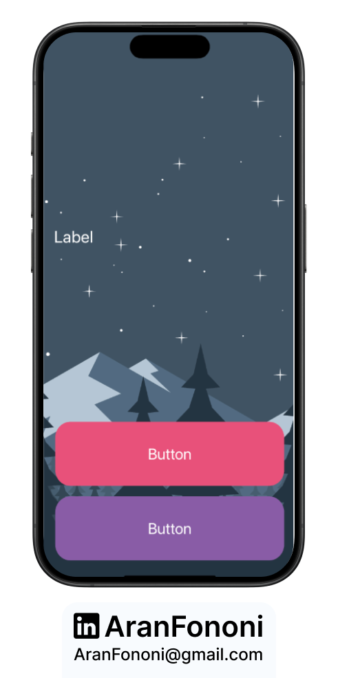
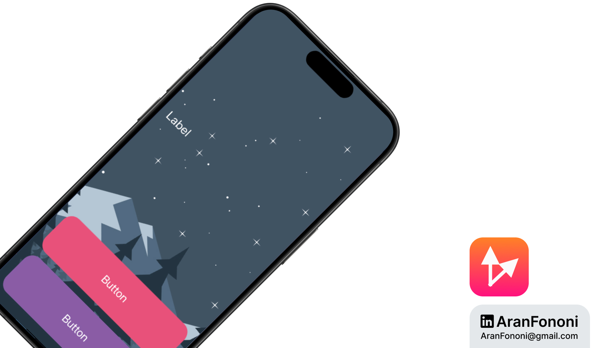

# Destini

### Project for Section 10: **Story-based App with User Choices**  
This project was completed as part of Section 10 in the **Complete iOS Development Bootcamp** by Angela Yu.

## Project Overview
The **Destini** app is an interactive storytelling application where users make choices that affect the outcome of the story. It features a branching narrative that changes based on user decisions.

## What I Learned
In this project, I focused on:
- **Structuring Story Data**: Created a structured way to manage story elements and user choices using a custom `Story` struct.
- **User Interaction and State Management**: Implemented logic to handle user choices and navigate through the story based on those choices.
- **UI Updates**: Managed dynamic updates to the UI based on user interactions.

## Key Skills
- Understanding of how to implement a branching narrative
- Effective use of structs for data organization
- Dynamic UI updates based on user input

## Additional Features
While building this app, I refined my understanding of managing complex data structures, allowing for a rich storytelling experience. The app can be easily expanded with more stories and choices.

---

### Project Preview

---

### Footer

---

## Contact
For more information, feel free to reach out:  
- **Email**: [aranfononi@gmail.com](mailto:aranfononi@gmail.com)  
- **LinkedIn**: [Aran Fononi](https://www.linkedin.com/in/aran-fononi-18182b265)
